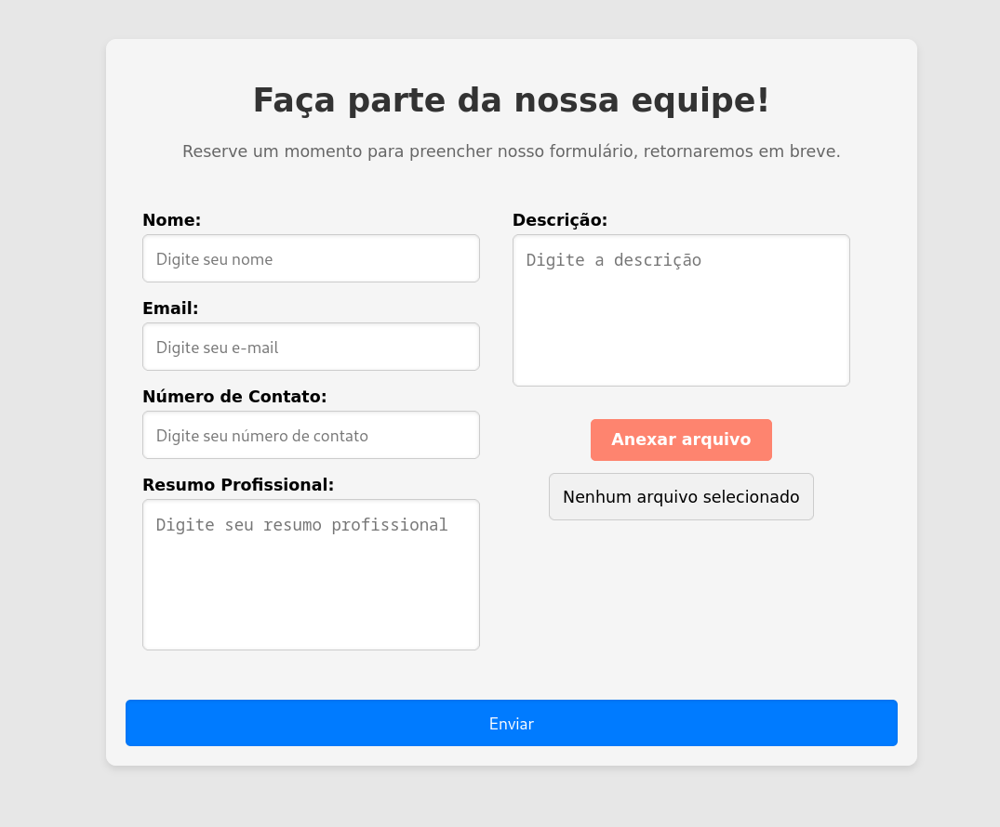

# Formulário Trabalhe Conosco

Este projeto é uma aplicação web para gerenciamento de formulários "Trabalhe Conosco", desenvolvida com PHP e Laravel para o backend e HTML, CSS, e JavaScript para o frontend. O banco de dados é gerenciado através do MySQL em containers Docker.

## Índice
- [Descrição Geral da Aplicação](#descrição-geral-da-aplicação)
- [Arquitetura](#arquitetura)
   - [Tecnologias Utilizadas](#tecnologias-utilizadas)
   - [Estrutura do Projeto](#estrutura-do-projeto)
   - [Regras de Validação](#regras-de-validação)
   - [Segurança](#segurança)
- [Instruções para Configuração e Execução](#instruções-para-configuração-e-execução)
  - [Configuração do `.env`](#configuração-do-env)
  - [Construir e subir os containers](#construir-e-subir-os-containers)
  - [Executar as migrações](#executar-as-migrações)
  - [Acessar a aplicação](#acessar-a-aplicação)
  - [Derrubar os containers](#derrubar-os-containers)


## Descrição Geral da Aplicação

A aplicação permite que os usuários enviem um formulário "Trabalhe Conosco" com os seguintes campos:

- Nome: Campo para o nome completo do candidato, essencial para identificar o remetente.
- Email: Campo para o endereço de e-mail do candidato, utilizado para comunicação e validação.
- Número de Contato: Campo para o número de telefone do candidato, facilitando contato direto.
- Resumo Profissional: Campo para um resumo breve das qualificações ou experiência do candidato.
- Descrição: Campo para uma descrição mais detalhada sobre o candidato ou a candidatura.
- Upload de arquivo: Campo para o envio de documentos, como currículos ou cartas de apresentação.

Os dados são validados e armazenados no banco de dados MySQL, e o arquivo é salvo no diretório `storage`.


## Tecnologias Utilizadas

- **Backend**: PHP com Laravel
- **Frontend**: HTML, CSS, JavaScript (integrado com Blade para renderização no Laravel)
- **Banco de Dados**: MySQL, configurado em Docker containers

## Arquitetura

A arquitetura do sistema para o projeto "Trabalhe Conosco" é projetada para ser modular e eficiente, utilizando as seguintes tecnologias e abordagens:

### Tecnologias Utilizadas

- **Backend**: PHP com **Laravel** - Framework robusto para o desenvolvimento de aplicações web, oferecendo uma estrutura MVC e integração fácil com banco de dados.
- **Frontend**: **HTML**, **CSS**, **JavaScript** - Para criar uma interface de usuário moderna e responsiva.
- **Banco de Dados**: **MySQL** - Utilizado para armazenar os dados dos formulários, configurado em um container Docker para garantir um ambiente isolado e consistente.
- **Containerização**: **Docker** - Usado para criar e gerenciar dois containers principais: um para o banco de dados MySQL e outro para a aplicação Laravel.

### Estrutura do Projeto

1. **Containerização com Docker**:
   - **MySQL Container**: Responsável por armazenar todos os dados do formulário, configurado para operar em um ambiente isolado.
   - **Laravel Container**: Executa a aplicação Laravel, gerenciando a lógica de negócios e a comunicação com o banco de dados.

2. **Configuração do Laravel**:
   - Integrado com Docker para oferecer um ambiente de desenvolvimento e produção consistente.
   - Utiliza **Blade**, o motor de templates do Laravel, para renderizar o frontend e integrar com o HTML, CSS e JavaScript.

3. **Implementação do Formulário**:
   - Uma página única, renderizada com **Blade**, que inclui campos para Nome, Email, Número de Contato, Resumo Profissional, Descrição e Upload de arquivo.

4. **Backend (Laravel)**:
   - **Validação de Dados**: Implementa validações rigorosas para garantir a integridade dos dados recebidos.
   - **Tratamento de Exceções**: Gerencia erros e exceções durante o processamento do formulário.
   - **Armazenamento de Dados**: Os dados do formulário são salvos no banco de dados MySQL, e os arquivos são armazenados na pasta `storage` do Laravel.

Essa arquitetura garante uma aplicação escalável e fácil de manter, aproveitando as melhores práticas de desenvolvimento e as tecnologias mais adequadas para o projeto.

### Regras de Validação

- **Nome**: Deve ser uma string, obrigatória e ter no máximo 255 caracteres.
- **Email**: Deve ser um e-mail válido e único no banco de dados (se necessário).
- **Número de Contato**: Deve ser um número com entre 10 e 15 dígitos.
- **Resumo Profissional**: Deve ser uma string sem caracteres especiais, com um limite de caracteres.
- **Descrição (Description)**: Similar ao Resumo Profissional, mas com um texto mais longo permitido.
- **Arquivo (File)**: Deve ser um PDF com um limite de tamanho.

### Segurança

- **Prevenção de Injeção de SQL**: O Laravel cuida automaticamente da injeção de SQL ao usar o Eloquent ORM ou o Query Builder. Quando você usa métodos como `create()`, o Laravel escapa automaticamente os dados inseridos, prevenindo ataques de injeção de SQL.
- **Proteção Contra CSRF**: A aplicação já inclui proteção contra ataques de Cross-Site Request Forgery (CSRF). O Laravel utiliza tokens CSRF para proteger formulários e outras requisições POST, PUT, DELETE e PATCH. O token CSRF é incluído automaticamente nos formulários gerados com Blade e é verificado pelo Laravel em cada requisição, garantindo que a solicitação seja originada do próprio site.

## Instruções para Configuração e Execução

### Configuração do `.env`

Copie o arquivo `.env.example` para criar o seu arquivo `.env`:

```bash
cp .env.example .env
```

Em seguida, edite o arquivo `.env` para configurar as variáveis de ambiente, especialmente as configurações de banco de dados e outras configurações necessárias.

### Construir e subir os containers

Utilize o comando abaixo para construir e iniciar os containers em segundo plano:

```bash
./vendor/bin/sail up --build -d
```

### Executar as migrações

Aplique as migrações no banco de dados com o comando:

```bash
./vendor/bin/sail artisan migrate
```

### Acessar a aplicação

Navegue até [http://localhost](http://localhost) no seu navegador para acessar a aplicação.

### Derrubar os containers

Para parar e remover os containers, utilize o comando:
```bash
./vendor/bin/sail down
```


